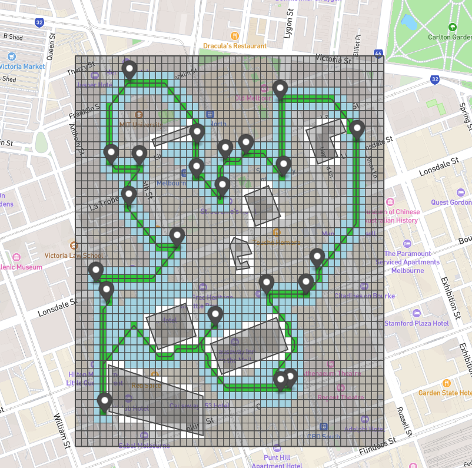

# Pathfinder_FlowGrid



## Overview

Pathfinder FlowGrid is a Java project that aims to solve a Traveling Salesman Problem (TSP) for drone
deliveries. The goal is to find an optimal route for a drone to visit different delivery points while avoiding
buildings. Users can create their own building and delivery point data to use with this project or use the sample files
provided.

This type of software could be used in conjunction with large data sets, such as Google Open Buildings, to create 
drone paths whilst avoiding buildings/ no-fly-zones. 

## Features

- **Route Optimisation:** The project uses dynamic programming memoization to optimise the delivery point visit order
  for efficient drone routes.

- **Pathfinding:** An A* algorithm is used to determine the paths between delivery points based on the optimised order.

- **User-Defined Data:** Users can provide their own building and delivery point data in GeoJSON and JSON formats,
  respectively.

- **Customisable Output:** The output geojson file can be customised in the `App` class to adjust the geojson output file

## Getting Started

To get started with the Drone Route Solver, follow these steps:

1. **Clone the Repository:**

   ```bash
   git clone https://github.com/andrew-campbell-13/Pathfinder_FlowGrid.git
   cd Pathfinder_FlowGrid
   ```

2. **Build the Project:**

    Make sure you have Maven installed. Then, build the project:

   ```bash
   mvn clean install
   ```
    
   Or use maven controls as part of your chosen IDE, I personally opt for IntelliJ


3. **Create Building and Delivery Point Data:**

    Use geojson.io to create polygons representing buildings inside your desired grid area.

    Create a JSON file containing an array of lnglat coordinates for your delivery points. See sample delivery point files for reference.


4. **Run the Drone Route Solver:**

    Run the project with the following command, specifying the required parameters:
    ```bash
    java -jar target/Pathfinder_FlowGrid-1.0-SNAPSHOT.jar <lat_top> <lat_bottom>  <lng_left> <lng_right> <square_size> <delivery_points.json> <buildings.geojson>
    ```

    Replace <lat_top>, <lat_bottom>, <lng_left>, <lng_right>, <square_size>, <delivery_points.json> and <buildings.geojson> with your specific parameters and data file names.
    <br>
    <br>
    **Parameter Thresholds:** 
     - lat_top > lat_bottom
     - lng_right > lng_left
     - square_size is smaller than the width/6 and height/6. I recommend a minimum of a 20:20 grid,
       - I would further recommend to not have a grid larger than 100:100 if you plan to visualise the grid in the geojson


5. **Visualize the Output GeoJSON:**

   After running the solver, the output will be saved to a geojson file (e.g. drone_path.geojson). You can visualize this file by pasting its contents into geojson.io. Simply open geojson.io in your web browser, paste the GeoJSON data, and explore the optimized drone route on the map.


Example usage:
 
   ```bash
  java -jar target/Pathfinder_FlowGrid-1.0-SNAPSHOT.jar -37.8070 -37.8170 144.9590 144.969 0.0002 delivery_points_Australia.json buildings_Australia.geojson
   ```
The output of these parameters is shown in the image at the top of the ReadMe.

## Customizing Output
You can customize what is displayed in the output GeoJSON file by modifying the App class in the source code. You can adjust the boolean values to determine what is shown in the output geojson file.

## Possible Future Additions
- *Smart Grid:* For use covering large areas, a grid could be created which splits into 4 sub grids if the current grid contains a buildings edge. A binary search tree could implement this in nlog(n) time.
- *Smooth Path:* Smooth the path travelled by the drone, individual drone move is currently from one grid square centre to the next.
- *Over 22 Delivery Points:* Implement K-Means Clustering to cluster close together points into 22 clusters. The existing DP algorithm can then be applied to the clusters.

## Acknowledgments
MapBox GeoJSON library
